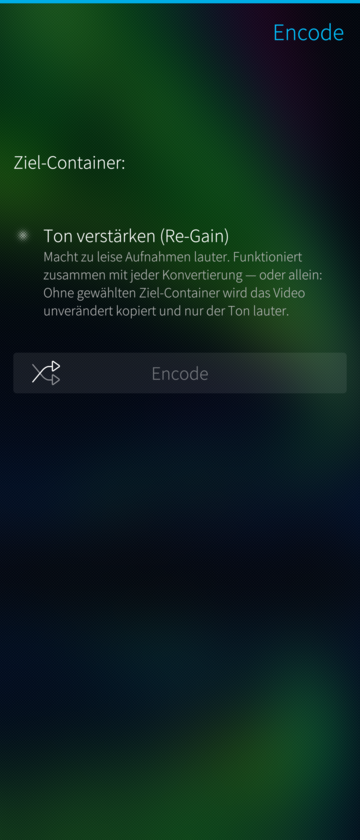
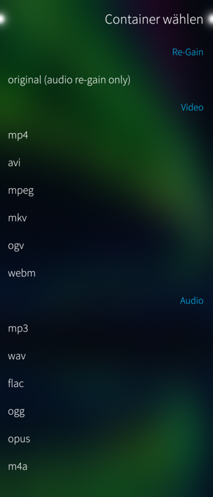
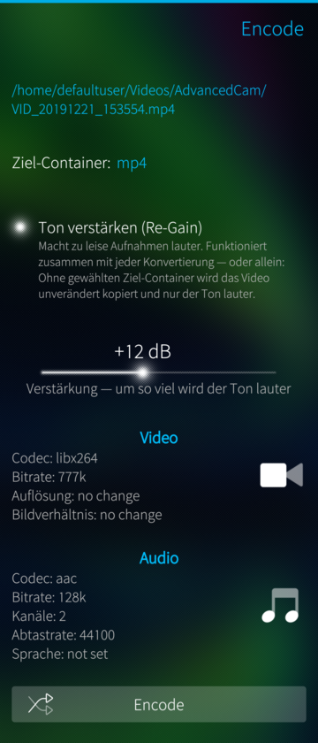

3ncode
======

Graphical video and audio converter for ffmpeg. 
This is the SailfishOS app branch.

---
---

Fork: revived for aarch64, with audio re-gain
=============================================

This fork of [llelectronics/3ncode](https://github.com/llelectronics/3ncode)
(branch `aarch64-revival`) makes the app work again on current 64-bit
Sailfish OS devices — tested on the Xperia 10 III — and adds a new feature.

<p>



</p>

**What we added**

- **Audio re-gain.** A switch on the main page boosts the audio of a file by
  a chosen amount (+3…+24 dB) — rescues recordings that are far too quiet.
  It combines with any conversion (compress *and* boost in one go), or works
  on its own via the container entry **"original (audio re-gain only)"**:
  then the video stream is copied bit for bit and only the audio is
  re-encoded — fast, and lossless for the picture.

**How we made it aarch64-capable**

- The app shipped static ffmpeg binaries only for 32-bit ARM and i486 — on
  aarch64 devices no ffmpeg was installed at all, which is why it silently
  stopped working. A **static aarch64 ffmpeg 7.0.2**
  ([johnvansickle.com/ffmpeg](https://johnvansickle.com/ffmpeg/), GPLv3) is
  now bundled and the packaging got an aarch64 case.
- **ffmpeg 7 compatibility:** the mp4/mkv/m4a presets used the long-removed
  `libfaac` encoder ("Unknown encoder"); they now use ffmpeg's native `aac`.
- Error messages now show the actual ffmpeg error instead of its banner.

Build with the Sailfish Platform SDK:

```sh
mb2 -t SailfishOS-5.0.0.62-aarch64 build
```

License: GPL, as the original. The bundled ffmpeg is a GPLv3 build; its
sources are available from the link above.
